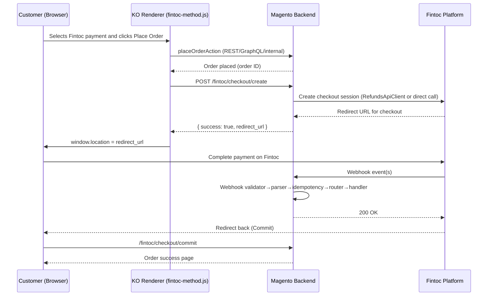

# Architecture and Flows — Fintoc_Payment

This document describes the architecture of the Fintoc_Payment module and the main runtime flows.

High-level architecture
- Presentation:
  - Frontend JS components (Knockout) render the payment method and handle redirect to Fintoc.
  - Adminhtml UI components (grids and detail screens) for transactions and refunds.
- Domain/Services:
  - TransactionService orchestrates creation and updates of transactions and histories.
  - RefundService executes refund operations via RefundsApiClient and updates orders.
  - Webhook pipeline (Validator → Parser → Idempotency → Router → Handlers) processes events from Fintoc.
- Persistence:
  - Transaction entity persisted in fintoc_payment_transactions via ResourceModel.
- Integration:
  - Guzzle HTTP client for calling Fintoc API.
  - Webhook endpoint (Controller) for inbound calls from Fintoc.
- Cross-cutting:
  - Logger with dedicated Monolog channel and custom handler.
  - ConfigurationService to read and normalize module configuration values.

Checkout flow (high-level)


Webhook processing pipeline
```mermaid
flowchart LR
  A[Webhook HTTP Request] --> B[WebhookRequestValidator\n(signature check)]
  B --> C[WebhookRequestParser\n(build WebhookEvent)]
  C --> D[WebhookIdempotencyService\n(ensure once-only)]
  D --> E[WebhookRouter\n(event type mapping)]
  E --> F[Concrete Handler\n(Refund/PaymentIntent/CheckoutSession)]
  F --> G[TransactionService\n(create/update Txn)]
  F --> H[Magento Order/Invoice\n(update state)]
  G --> I[(DB fintoc_payment_transactions)]
```

Component relationships (overview)
- Api contracts in Fintoc\Payment\Api are bound to concrete implementations in Model/ or Service/ via preferences declared in etc/di.xml.
- Webhook router receives a map of event types → handler instances via <type name="...WebhookRouter"><arguments>...</arguments></type> in etc/di.xml.
- Payment model is injected with a dedicated logger virtual type (FintocPaymentMethodLogger).
- Checkout Create/Commit controllers receive Guzzle client and Logger through typed arguments in etc/di.xml.

See also
- technical-overview.md — component inventory and responsibilities
- webhook-flow.md — deep dive into webhook implementation
- uml-class-diagram.[puml|mmd] — class relationships
