# User Guide — Fintoc_Payment

This user guide is intended for Magento administrators and support agents who configure and operate the Fintoc payment method.

Overview
- Fintoc_Payment adds a redirect-based payment method to your Magento 2 store. Customers place their order and are redirected to Fintoc to complete payment. Status updates are synchronized back to Magento via webhooks.

Prerequisites
- A Fintoc account with API and Webhook credentials.
- Magento 2 store admin access.

Installation (if not preinstalled)
1) Ensure the module is installed and enabled by your developer or partner.
   - Example (for developers):
     - composer require fintoc/module-payment
     - bin/magento module:enable Fintoc_Payment
     - bin/magento setup:upgrade
     - bin/magento cache:flush

Configuration
1) Log in to Magento Admin.
2) Go to Stores → Configuration → Sales → Payment Methods → Fintoc.
   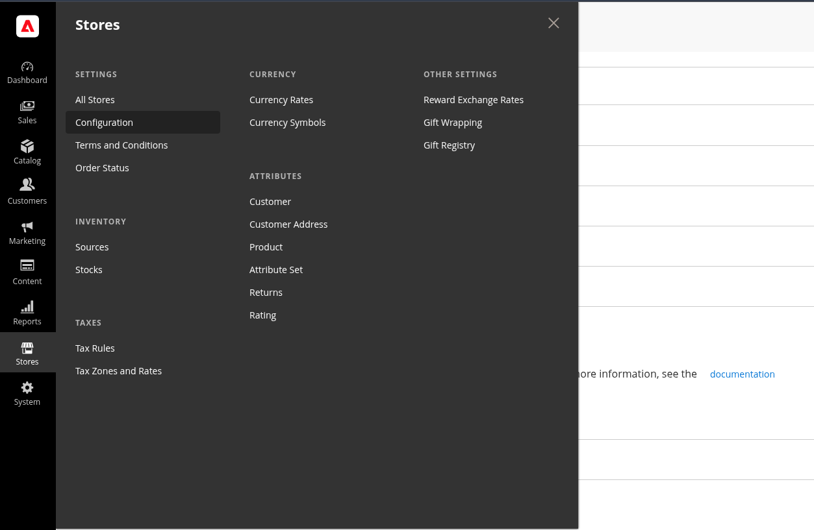
   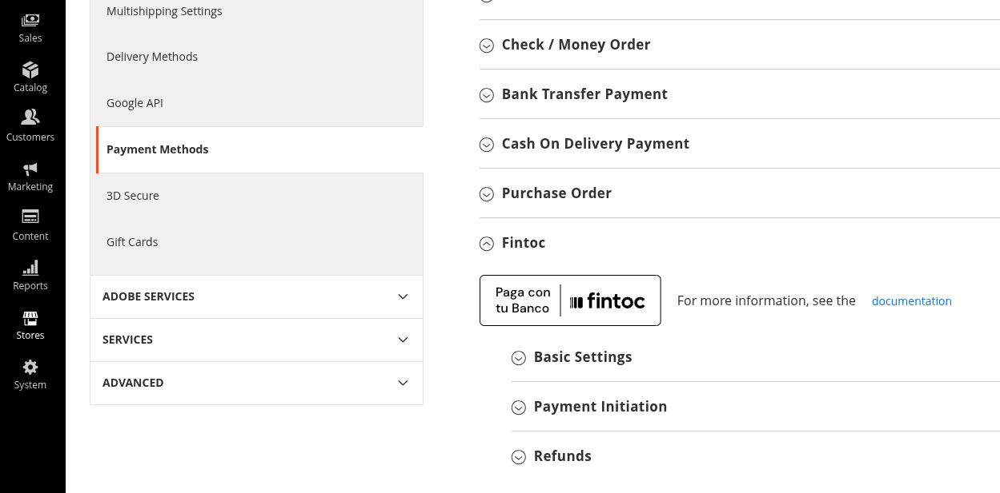
3) In the Basic Settings group, enter your Fintoc credentials:
   - Secret API Key. [Get your secret key here](https://dashboard.fintoc.com/api-keys)
   - Webhook Secret.
   - Optional: Enable Logging, Debug Mode, set Debug Level, and toggle Log Sensitive Data.
   [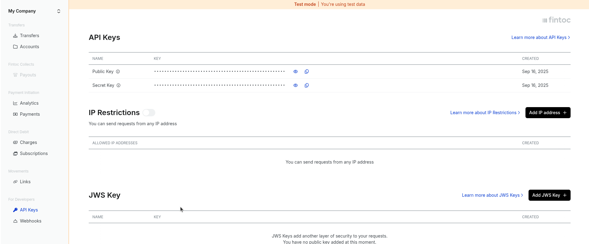](https://docs.fintoc.com/docs/api-keys)
   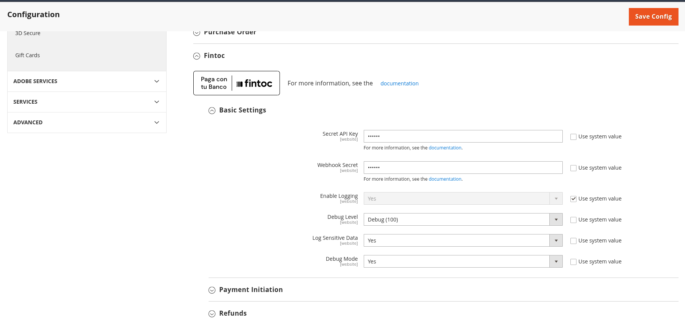
4) In the Payment Initiation group, set:
   - Enabled = Yes.
   - Title = the name shown to customers (e.g., "Pay with Fintoc").
   - Automatically Invoice All Items (as desired).
   - New Order Status (usually Pending or Processing depending on your invoicing policy).
   - Applicable Countries and Specific Countries (if restricting availability).
   - Maximum Order Amount (leave blank for no limit).
   - Sort Order (display order in checkout).
   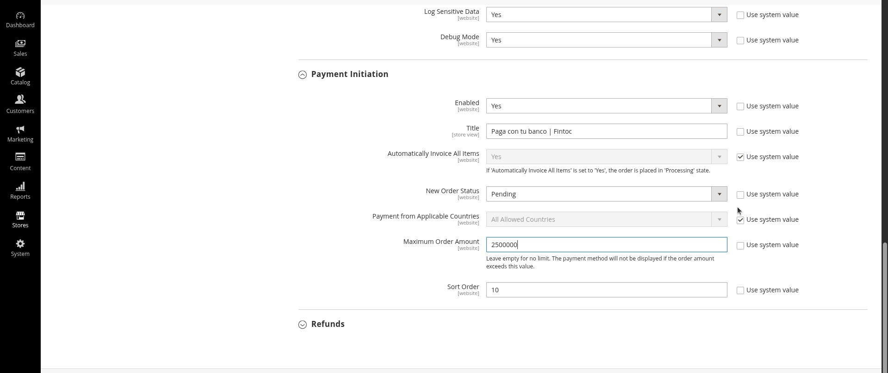
5) In the Refunds group (optional), configure:
   - Enable Refunds and Allow Partial Refunds.
   - Auto-create Credit Memo on Refund Succeeded.
   - Set order status transitions for refund pending/succeeded/failed/canceled.
   - Select refundable order statuses.
   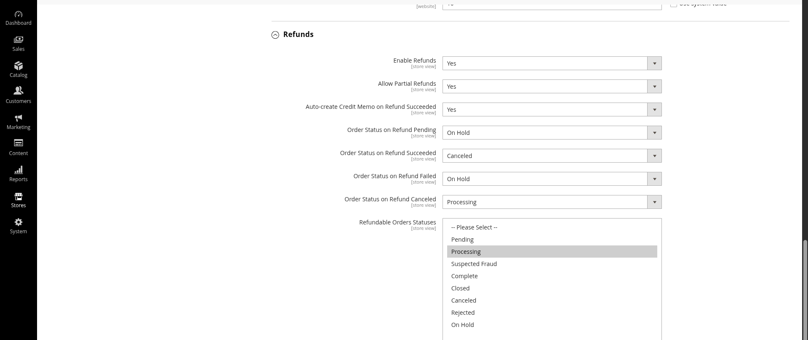
6) Save Config and clear caches if prompted.

Webhook setup
1) In the Fintoc Dashboard, create a webhook pointing to:
- {BASE_URL}/fintoc/webhook
- Method: POST
2) Copy the Webhook Secret from Fintoc and paste it into Magento (Stores → Configuration → Sales → Payment Methods → Fintoc → Basic Settings → Webhook Secret).
3) Test delivery from Fintoc and confirm Magento responds with 200 OK.
   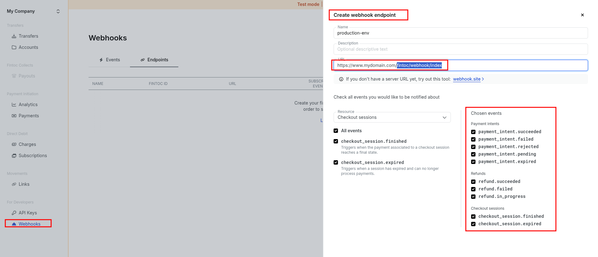

Multistore / Multi-website configuration
If your Magento instance serves multiple storefronts, configure Fintoc per scope so each website can use the correct credentials and webhook URL.

1) Pick the scope before editing
- Go to Stores → Configuration → Sales → Payment Methods → Fintoc.
- Use the Scope switcher in the top-left to choose the Website or Store View you want to configure. Uncheck "Use Default" or "Use Website" to override values.

2) Configure credentials per website
- Secret API Key: Set the key that belongs to the website’s Fintoc project/account.
- Webhook Secret: Set the secret that matches the webhook you created for this website in the Fintoc Dashboard.
- It’s OK to reuse the same keys across websites if your Fintoc account allows, but using per-website keys and webhook secrets is recommended for isolation and troubleshooting.

3) Webhook URL per website
- Each website typically has its own base URL. Configure a dedicated webhook in Fintoc for each base URL:
  - {WEBSITE_BASE_URL}/fintoc/webhook
- Paste the corresponding Webhook Secret in that website’s configuration in Magento.

4) Environments (Sandbox vs Production)
- Keep sandbox and production completely separate (different API Secret and Webhook Secret, different webhook endpoints/domains).
- Use Magento’s scope overrides to place sandbox keys on staging sites and production keys on live sites.

5) Tips
- If you have multiple language store views under the same website, configure at Website scope unless you need different titles/sort order per Store View.
- After saving, flush caches when prompted. Place a test order on each storefront and verify you see transactions under Sales → Fintoc → Transactions.

How webhooks and invoicing work (at a glance)
- Order placement: The customer is redirected to Fintoc. Magento creates a transaction row and sets the order to your configured New Order Status (usually Pending).
- Webhook event payment_intent.succeeded: The module verifies the Fintoc-Signature using your Webhook Secret, then creates a paid invoice for the order and marks the transaction as successful. If an invoice already exists, the handler skips creating a duplicate.
- Webhook events failed/rejected/expired: The module cancels the order (if applicable), marks the transaction as failed, and restores the customer’s quote so they can try again.
- Timing: Whether the customer returns before or after the webhook arrives, the webhook is the source of truth for payment status. It will advance the order and create the invoice when appropriate.
- Duplicate safety: Re-deliveries from Fintoc are safe; handlers are idempotent and won’t create duplicate invoices.
- Troubleshooting: On signature verification failure, the module returns 5xx and logs the error. Check var/log/fintoc.log and order history comments for details.

Customer checkout experience
1) Customer adds items to cart and proceeds to checkout.
2) On the Payment Method step, the customer selects Fintoc and clicks Place Order.
    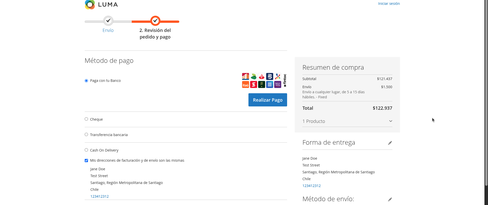
3) The customer is redirected to Fintoc to complete the payment.
   
4) After completion, the customer returns to your store and sees the Order Success page.
    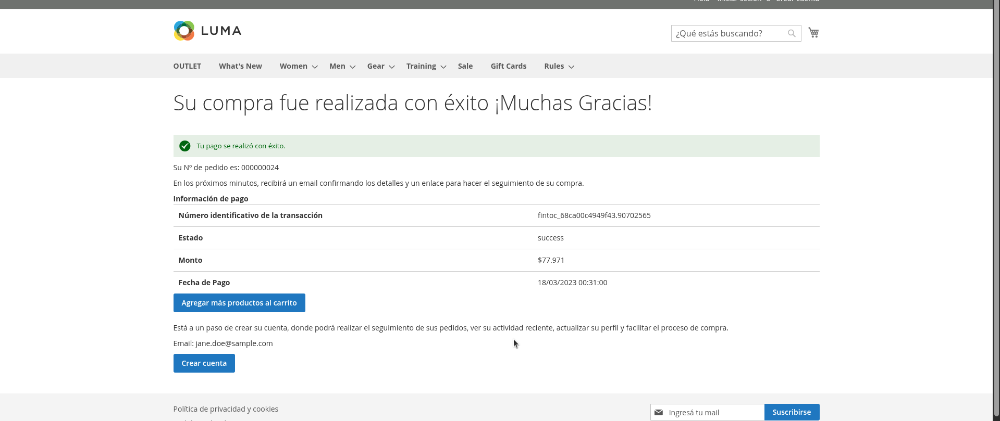

Viewing transactions (Admin)
1) Go to Sales → Fintoc → Transactions.
2) Use filters to find a specific order or transaction.
3) Click into a transaction to view details and webhook history.
    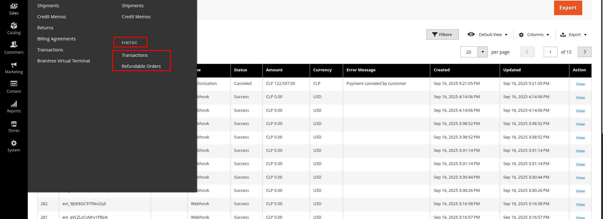
    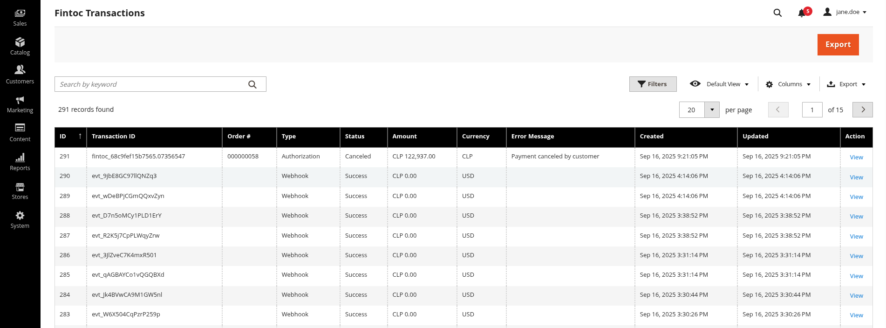
    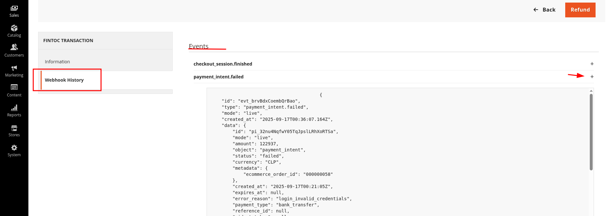

Refunds (Admin)
- From Sales → Fintoc → Refundable Orders, open a refund form for an order and submit.
- Alternatively, use the standard Magento Credit Memo flow if enabled by your configuration.
    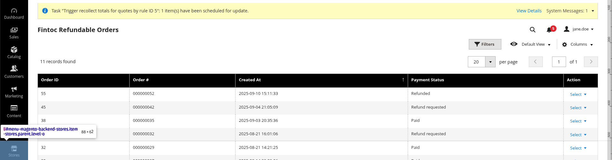
    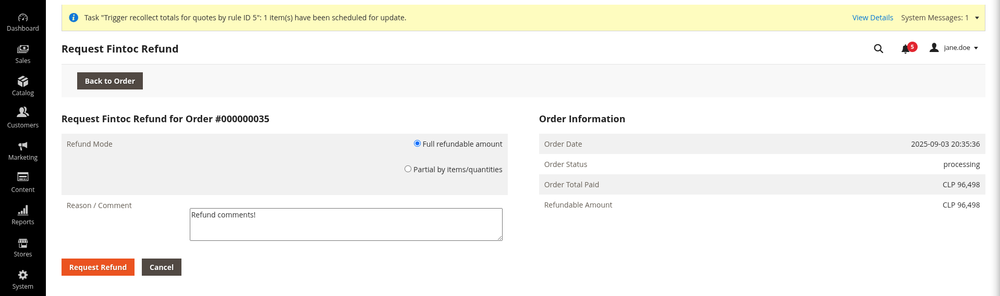

Tips and best practices
- Keep logging enabled in production at a reasonable Debug Level. Avoid logging sensitive data unless requested by support.
- Verify that your server is publicly reachable by Fintoc for webhooks (firewalls, maintenance mode, IP allowlists).
- If customers report missing payment method, check country restrictions and maximum order amount settings.

Troubleshooting
- Webhook errors (401/400): Re-check the Webhook Secret and ensure Fintoc sends the correct signature header.
- Webhook errors (5xx): check the logs in var/log/fintoc.log.
- Payment method not visible: Ensure it is enabled, not exceeding Max Order Amount, and allowed for the current country.
- Refund not reflected: Confirm Refunds are enabled and that the webhook events for refund were delivered.

Support
- Provide recent entries from var/log/fintoc*.log when contacting support.
- Share the order increment ID and (if available) the Fintoc transaction_id for faster diagnosis.
